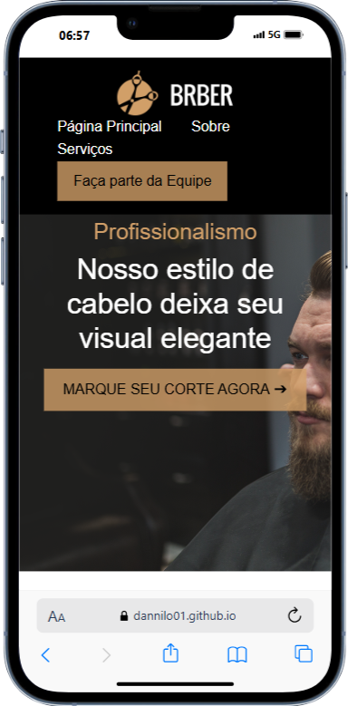

# Projeto Final - _barbearia_

### Barber Shop

# Paleta de Cores

- #d19f68
- #ffffff
- #000000
- #333
- #d19f68cc
- #bc8f5e
- #f9f9f9

# Tipografria

Arial, sans-serif

# Informações de Contato

- Danilo Costa
- Telefone: 61984245913
- Email: dannayllow100@gmail.com
- Instagram: @dan.nilo01

# Site

[Barbearia](https://dannilo01.github.io/FinalProject_Front-End/)

[GitHub](https://github.com/Dannilo01/FinalProject_Front-End)

# Exigências da página:

- [x] Mínimo 5 sessões (desconsiderando header e footer)
- [x] Uma das sessões deve ser a área de contatos com formulário.
- [x] Responsivo
- [x] Somente um dos itens do projeto pode ser usado do bootstrap
- [x] A navegação deve levar a outras áreas do site
- [x] Deve conter um botão de ação que ao ser clicado redirecione para o WhatsApp
- [x] O menu deve ser fixo
- [x] Layout moderno
- [x] Deve conter um vídeo em uma das sessões
- [x] No rodapé do site deve conter link para as redes sociais dos desenvolvedores assim como para o github
- [x] Site deve ser hospedado
- [x] Deve conter um carrossel
- [x] Deve conter um área de FAQ com no mínimo 10 perguntas e respostas.
- [x] Formulário de contatos:
- [x] Deve conter campos de para os registro de informações ao clicar no botão de submissão deve ser emitido um alerta com as informações preenchidas.
- [x] Readme contendo:
    - [x] descrição do projeto
    - [x] paleta de cores
    - [x] tipografia
    - [x] lista de tarefas do projeto
    - [x] mockup (mobile e notebook)
    - [x] informações de contato
    - [x] link de acesso ao site
    - [x] tecnologias utilizadas (link para pagina oficial da tecnologia)